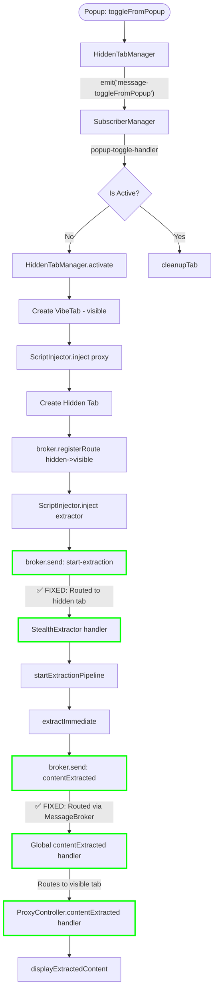
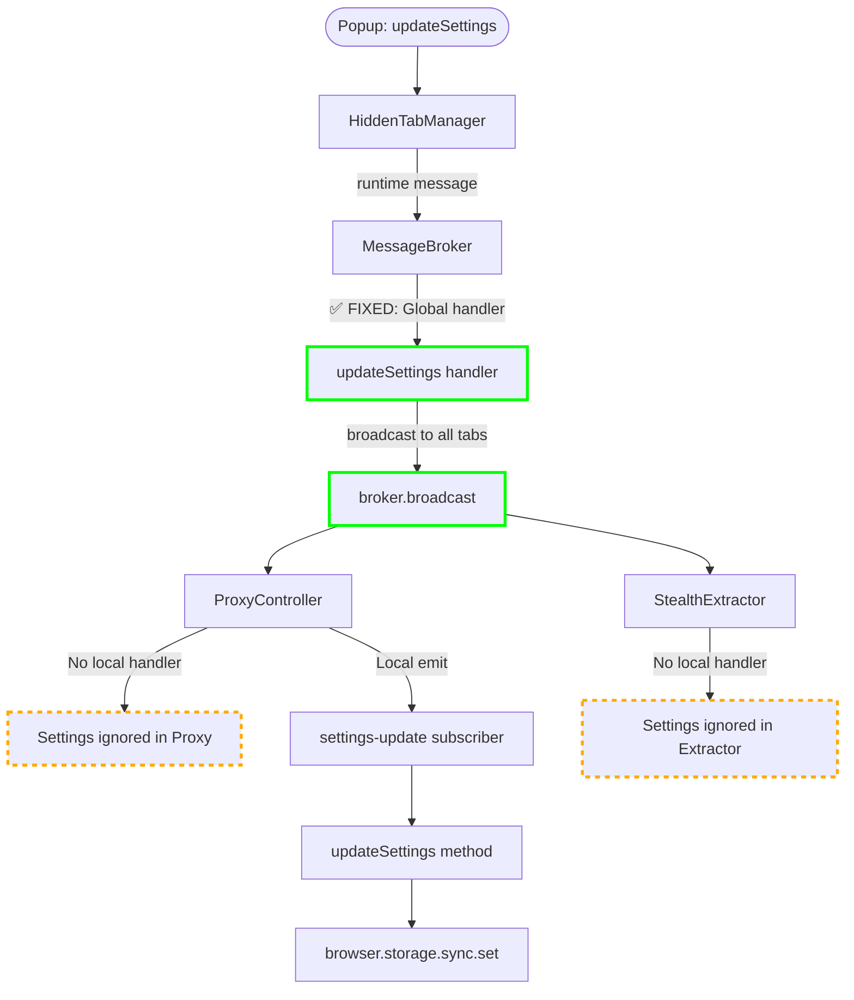
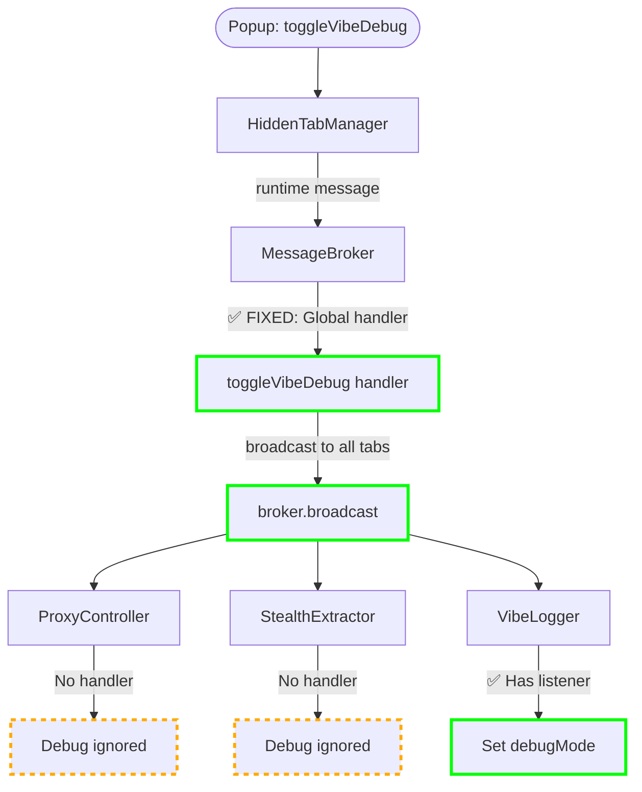
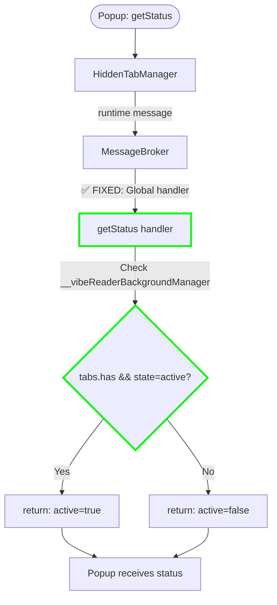
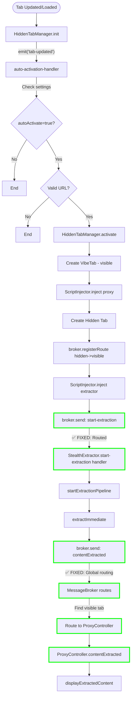
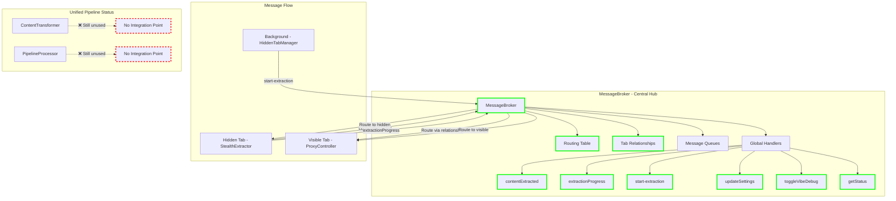

# Enhanced Subscriber Architecture for VibeReader v2.0
Looking at the enhanced code, I can see significant improvements with the MessageBroker handling routing and the addition of proper message handlers. Here are the updated flow diagrams:

## 1. Toggle From Popup Flow (Updated)



## 2. Update Settings Flow (Updated)



## 3. Toggle Debug Flow (Updated)



## 4. Get Status Flow (Updated)



## 5. Auto-Activation Flow (Updated)



## Enhanced Message Flow Architecture



## Key Improvements from Updates:

✅ **Fixed Issues:**
1. `start-extraction` - Now handled by StealthExtractor via MessageBroker routing
2. `contentExtracted` - Properly routed from hidden to visible tab via broker relationships
3. `extractionProgress` - Routed correctly through broker
4. `updateSettings` - Global handler broadcasts to all tabs
5. `toggleVibeDebug` - Global handler broadcasts to all tabs
6. `getStatus` - Global handler checks HiddenTabManager state

⚠️ **Partially Fixed:**
1. Settings/Debug messages reach tabs but ProxyController and StealthExtractor don't process them
2. Memory warning event still has no handler but less critical

❌ **Still Broken:**
1. ContentTransformer and PipelineProcessor remain completely disconnected
2. No unified pipeline processing of extracted content
3. Terminal extensibility mentioned but not implemented

The MessageBroker successfully acts as a central routing hub, fixing the main communication issues between components. The unified pipeline components remain architectural debt that could be removed or properly integrated in a future update.
## Overview

The Enhanced Subscriber Architecture provides a robust, middleware-based event system with automatic error recovery, rate limiting, and content transformation capabilities. It replaces traditional event listeners with intelligent subscribers that can filter, transform, and manage event data flow.

## Core Components

### 1. SubscriberEnabledComponent (Base Class)

Every component that needs event handling extends this base class:

```javascript
class MyComponent extends SubscriberEnabledComponent {
    constructor() {
        super(); // Sets up subscriberManager and subscriptions array
        this.setupSubscriptions();
    }
    
    setupSubscriptions() {
        // Your subscription setup here
    }
}
```

### 2. VibeSubscribe (Individual Subscriber)

Each subscription creates a VibeSubscribe instance with:
- Unique ID
- Callback function
- State management (active/paused/disabled)
- Middleware chain
- Error recovery with quarantine system
- Rate limiting and debouncing

### 3. SubscriberManager

Manages all subscriptions for a component:
- Routes events to appropriate subscribers
- Handles priority ordering
- Manages global middleware
- Provides statistics and monitoring

## Basic Usage

### Simple Subscription

```javascript
// Basic event subscription
this.subscribe('content-updated', (eventType, data) => {
    console.log('Content updated:', data.content);
});
```

### Subscription with Options

```javascript
this.subscribe('media-discovered', 
    (eventType, data) => {
        console.log(`Found ${data.images} images`);
    },
    {
        id: 'media-handler',
        rateLimitMs: 200,      // Max once per 200ms
        debounceMs: 500,       // Wait 500ms after last event
        priority: 10,          // Higher priority executes first
        maxRetries: 3,         // Retry failed callbacks
        eventTypes: ['media-discovered', 'media-processed']
    }
);
```

## Advanced Examples (Detailed)

### Understanding Transformation Functions

Transformations are functions that modify event data before it reaches your callback. Let's break down the arrow function syntax:

```javascript
// DETAILED BREAKDOWN OF ARROW FUNCTION
this.subscribe('content-updated', 
    // This is your main callback that receives the final data
    (eventType, data) => {
        console.log('Processed content:', data);
    },
    {
        transformations: [
            // TRANSFORMATION FUNCTION EXPLAINED:
            // This arrow function receives three parameters:
            // - data: the event data being passed
            // - context: metadata about the event
            // - eventContext: full event information
            (data, context, eventContext) => {
                // Inside the function, we can modify the data
                
                // Step 1: Check if we should process this data
                if (!data.content || data.content.length < 100) {
                    // Return null to skip this event entirely
                    return null;
                }
                
                // Step 2: Transform the data
                const transformedData = {
                    ...data,  // Keep all original properties
                    content: data.content.toUpperCase(), // Modify content
                    processedAt: Date.now(), // Add new property
                    originalLength: data.content.length // Add metadata
                };
                
                // Step 3: Return the transformed data
                // Must return an object with 'data' property
                return {
                    data: transformedData,
                    context: {
                        ...context,
                        transformed: true
                    }
                };
            }
        ]
    }
);
```

### Multiple Transformations with Detailed Explanation

```javascript
this.subscribe('dom-mutations',
    // Main callback receives final transformed data
    (eventType, data) => {
        console.log('High-value mutations:', data);
    },
    {
        transformations: [
            // FIRST TRANSFORMATION: Filter insignificant mutations
            (data, context) => {
                // Calculate a score for the mutation
                const score = 
                    (data.newImages || 0) * 2 +
                    (data.newVideos || 0) * 5 +
                    (data.newTextContent || 0) * 0.01;
                
                // If score is too low, filter out this event
                if (score < 5) {
                    return null; // This stops processing
                }
                
                // Otherwise, add the score to the data
                return {
                    data: {
                        ...data,
                        mutationScore: score
                    }
                };
            },
            
            // SECOND TRANSFORMATION: Categorize mutations
            (data, context) => {
                // Determine category based on score
                let category;
                if (data.mutationScore > 20) {
                    category = 'critical';
                } else if (data.mutationScore > 10) {
                    category = 'important';
                } else {
                    category = 'normal';
                }
                
                // Add category to data
                return {
                    data: {
                        ...data,
                        category: category,
                        shouldReExtract: category === 'critical'
                    }
                };
            },
            
            // THIRD TRANSFORMATION: Add suggestions
            (data, context) => {
                // Create actionable suggestions based on data
                const suggestions = [];
                
                if (data.newImages > 3) {
                    suggestions.push({
                        action: 'process-images',
                        reason: 'Multiple new images detected'
                    });
                }
                
                if (data.shouldReExtract) {
                    suggestions.push({
                        action: 're-extract',
                        reason: 'Critical content change'
                    });
                }
                
                // Add suggestions to data
                return {
                    data: {
                        ...data,
                        suggestions: suggestions
                    }
                };
            }
        ]
    }
);
```

### Real-World Example: Media Processing Pipeline

```javascript
class MediaProcessor extends SubscriberEnabledComponent {
    setupMediaSubscriptions() {
        // Subscribe to media discovery with full pipeline
        this.subscribe('media-discovered',
            // FINAL CALLBACK: Process the fully transformed media data
            async (eventType, mediaData) => {
                // At this point, mediaData has been:
                // 1. Filtered for quality
                // 2. Enhanced with metadata
                // 3. Prepared for ASCII conversion
                
                for (const image of mediaData.processableImages) {
                    if (image.shouldConvertToAscii) {
                        await this.convertToAscii(image);
                    } else {
                        await this.displayAsEmoji(image);
                    }
                }
                
                // Update UI with counts
                this.updateMediaStats(mediaData.stats);
            },
            {
                id: 'media-processor',
                debounceMs: 300,  // Wait for multiple discoveries
                maxRetries: 2,
                transformations: [
                    // TRANSFORMATION 1: Filter and validate media
                    (data) => {
                        // Extract images from various sources
                        const images = [];
                        
                        // From img tags
                        if (data.imgElements) {
                            data.imgElements.forEach(img => {
                                const src = img.src || img.dataset.src;
                                if (src && this.isValidImageUrl(src)) {
                                    images.push({
                                        type: 'img',
                                        src: src,
                                        width: img.width,
                                        height: img.height,
                                        element: img
                                    });
                                }
                            });
                        }
                        
                        // From background images
                        if (data.backgroundImages) {
                            data.backgroundImages.forEach(bg => {
                                images.push({
                                    type: 'background',
                                    src: bg.url,
                                    element: bg.element
                                });
                            });
                        }
                        
                        // Skip if no valid images
                        if (images.length === 0) {
                            return null;
                        }
                        
                        return {
                            data: {
                                ...data,
                                images: images,
                                imageCount: images.length
                            }
                        };
                    },
                    
                    // TRANSFORMATION 2: Calculate dimensions and quality
                    async (data) => {
                        // Enhance each image with calculated properties
                        const enhancedImages = await Promise.all(
                            data.images.map(async (img) => {
                                // Calculate area
                                const area = (img.width || 100) * (img.height || 100);
                                
                                // Determine display mode based on size
                                let displayMode;
                                if (area < 10000) {  // < 100x100
                                    displayMode = 'emoji';
                                } else if (area < 40000) {  // < 200x200
                                    displayMode = 'emoji-large';
                                } else {
                                    displayMode = 'ascii';
                                }
                                
                                return {
                                    ...img,
                                    area: area,
                                    displayMode: displayMode,
                                    quality: area > 10000 ? 'high' : 'low',
                                    shouldConvertToAscii: displayMode === 'ascii'
                                };
                            })
                        );
                        
                        return {
                            data: {
                                ...data,
                                images: enhancedImages
                            }
                        };
                    },
                    
                    // TRANSFORMATION 3: Group and prepare final data
                    (data) => {
                        // Group images by display mode
                        const processableImages = [];
                        const emojiImages = [];
                        
                        data.images.forEach(img => {
                            if (img.shouldConvertToAscii) {
                                processableImages.push(img);
                            } else {
                                emojiImages.push(img);
                            }
                        });
                        
                        // Calculate statistics
                        const stats = {
                            total: data.images.length,
                            ascii: processableImages.length,
                            emoji: emojiImages.length,
                            averageSize: data.images.reduce((sum, img) => 
                                sum + img.area, 0) / data.images.length
                        };
                        
                        return {
                            data: {
                                processableImages: processableImages,
                                emojiImages: emojiImages,
                                stats: stats,
                                originalData: data
                            }
                        };
                    }
                ]
            }
        );
    }
    
    // Helper methods referenced in transformations
    isValidImageUrl(url) {
        return url && (
            url.startsWith('http') || 
            url.startsWith('data:') ||
            url.startsWith('//')
        );
    }
}
```

## Middleware System

### Built-in Middleware

Each subscriber automatically gets these middleware in order:

1. **StateValidationMiddleware** - Checks if subscriber is active
2. **RateLimitMiddleware** - Enforces rate limiting and debouncing
3. **EventFilterMiddleware** - Filters events by type
4. **TransformationMiddleware** - Applies data transformations
5. **ErrorRecoveryMiddleware** - Handles retries and failures
6. **DeliveryMiddleware** - Final delivery to callback

### Custom Middleware Example

```javascript
// Create custom middleware for logging
class LoggingMiddleware extends SubscriberMiddleware {
    constructor(logLevel = 'info') {
        super('Logging');
        this.logLevel = logLevel;
    }
    
    async process(eventContext) {
        const { event, data, subscriber } = eventContext;
        
        // Log the event
        console.log(`[${this.logLevel}] Event: ${event}`, {
            subscriberId: subscriber.id,
            dataSize: JSON.stringify(data).length,
            timestamp: Date.now()
        });
        
        // Continue processing
        return true;  // Return false to block event
    }
}

// Add to a subscriber
const unsubscribe = this.subscribe('my-event', callback, {
    id: 'logged-subscriber'
});

// Add custom middleware to this specific subscriber
const subscriber = this.subscriberManager.getSubscriber('my-event', 'logged-subscriber');
subscriber.addMiddleware(new LoggingMiddleware('debug'));
```

## Error Recovery and Quarantine

Subscribers automatically handle failures:

```javascript
this.subscribe('risky-operation',
    async (eventType, data) => {
        // This might fail
        await riskyDatabaseOperation(data);
    },
    {
        maxRetries: 3,              // Try 3 times
        fallbackBehavior: 'fallback', // Use fallback on failure
        fallbackCallback: async (eventType, data, error) => {
            // This runs if main callback fails after retries
            console.error('Operation failed, using cache:', error);
            return getCachedData();
        }
    }
);
```

After 5 consecutive failures, a subscriber is quarantined with exponential backoff (up to 64 minutes).

## Performance Optimization

### Rate Limiting

```javascript
// Limit to one execution per 100ms
this.subscribe('high-frequency-event', handler, {
    rateLimitMs: 100
});
```

### Debouncing

```javascript
// Wait 500ms after last event before executing
this.subscribe('user-input', handler, {
    debounceMs: 500
});
```

### Priority Ordering

```javascript
// Higher priority subscribers execute first
this.subscribe('critical-event', criticalHandler, {
    priority: 100  // Executes before priority 50
});

this.subscribe('critical-event', normalHandler, {
    priority: 50   // Executes after priority 100
});
```

## Implementation Notes

### Current Implementation Status (v2.0)

✅ **Fully Implemented:**
- Base `SubscriberEnabledComponent` class in vibe-utils.js
- Complete `VibeSubscribe` class with all middleware
- `SubscriberManager` with full event routing
- All middleware classes (validation, serialization, timing, etc.)
- Integration with `EventBus`, `MessageBridge`, and `ThrottledEmitter`
- Enhanced `VibeLogger` with subscriber architecture
- Quarantine system with exponential backoff
- Priority-based execution ordering

✅ **Components Using Subscriber Architecture:**
- `StealthExtractor` - Full implementation with pipeline subscriptions
- `ProxyController` - Terminal event subscriptions
- `HiddenTabManager` - Message handler subscriptions
- `VibeLogger` - Terminal category subscriptions
- `EventBus` - Enhanced with automatic categorization
- `MessageBridge` - Cross-context message routing

### Migration Path from Legacy Code

```javascript
// OLD: Legacy event listener
this.eventBus.on('my-event', (data) => {
    console.log(data);
});

// NEW: Subscriber with options
this.subscribe('my-event', 
    (eventType, data) => {
        console.log(data);
    },
    {
        id: 'my-event-handler',
        rateLimitMs: 50  // Automatic rate limiting
    }
);
```

### Best Practices

1. **Always provide an ID** for important subscriptions for debugging
2. **Use transformations** to filter and shape data early
3. **Set appropriate rate limits** for high-frequency events
4. **Implement fallback callbacks** for critical operations
5. **Clean up subscriptions** in deactivate/destroy methods
6. **Use categories** for terminal logging subscriptions

### Memory Management

The architecture includes automatic cleanup:

```javascript
class MyComponent extends SubscriberEnabledComponent {
    activate() {
        // Subscriptions are tracked automatically
        this.subscribe('event1', handler1);
        this.subscribe('event2', handler2);
    }
    
    deactivate() {
        // Automatically unsubscribes all
        super.deactivate();
        // Your cleanup code
    }
    
    destroy() {
        // Complete cleanup
        super.destroy();
        // Your destruction code
    }
}
```

### Debugging

```javascript
// Get subscriber statistics
const stats = this.getSubscriberStats();
console.log('Active subscribers:', stats.byState.active);
console.log('Quarantined:', stats.quarantined);

// Get event statistics  
const eventStats = this.getEventStats();
console.log('Event frequencies:', eventStats);

// Monitor specific subscriber
const subscriber = this.subscriberManager.getSubscriber('my-event', 'my-id');
console.log('Subscriber state:', subscriber.getStats());
```

## Future Enhancements

- [ ] Persistent subscription state across sessions
- [ ] Visual debugging tool for subscription flows
- [ ] Performance profiling for transformations
- [ ] Subscription replay for testing
- [ ] Remote subscription management API

# How Middleware Augmented vibe-utils.js Classes

## EventBus Transformation

The middleware system fundamentally changed EventBus from a simple pub/sub pattern to an intelligent event router:

### Before Middleware
```javascript
// Old EventBus - basic event emission
class EventBus {
    emit(event, data) {
        const handlers = this.listeners.get(event);
        handlers.forEach(handler => handler(data));
    }
}
```

### After Middleware Integration
```javascript
class EventBus extends SubscriberEnabledComponent {
    emit(eventType, data, context = {}) {
        // Now goes through SubscriberManager's middleware chain:
        // 1. StateValidation - checks if subscribers are active
        // 2. RateLimit - prevents flooding
        // 3. EventFilter - routes to correct subscribers
        // 4. Transformation - modifies data
        // 5. ErrorRecovery - handles failures
        // 6. Delivery - final callback execution
        
        return super.emit(eventType, data, {
            ...context,
            category: this.categorizeEvent(eventType),
            source: detectVibeContext(),
            timestamp: Date.now()
        });
    }
}
```

The middleware adds:
- **Automatic categorization** - Events are tagged with terminal categories (ERRORS, CSS, MEDIA, etc.)
- **Rate limiting per subscriber** - Each listener can have different throttling
- **Error isolation** - One failing listener doesn't crash others
- **Transformation pipeline** - Data can be modified before reaching handlers

## MessageBridge Enhancement

MessageBridge gained cross-context awareness and validation through middleware:

### Key Middleware Additions

```javascript
class MessageBridge extends SubscriberEnabledComponent {
    setupCrossContextMiddleware() {
        // These run on EVERY message handler
        this.subscriberManager.addGlobalMiddleware(
            new MessageValidationMiddleware()    // Validates message structure
        );
        this.subscriberManager.addGlobalMiddleware(
            new MessageSerializationMiddleware() // Handles complex objects
        );
        this.subscriberManager.addGlobalMiddleware(
            new MessageTimingMiddleware()        // Tracks performance
        );
        this.subscriberManager.addGlobalMiddleware(
            new BypassLoggingMiddleware()        // Respects BYPASS_LOGGING flag
        );
    }
}
```

### What This Provides

**MessageValidationMiddleware** ensures messages have required fields:
```javascript
// Automatically validates based on action type
if (action === 'contentExtracted' && !data.content) {
    return false; // Blocks invalid message
}
```

**MessageSerializationMiddleware** handles complex objects that can't cross contexts:
```javascript
// Automatically serializes DOM elements, Errors, Maps, Sets, etc.
// Before: Passing a DOM element would fail silently
// After: Element is converted to serializable format
```

**MessageTimingMiddleware** adds performance tracking:
```javascript
// Every message automatically gets timing data
context.timing = {
    duration: 15.3,
    startTime: 1234567890,
    endTime: 1234567905
}
```

## ThrottledEmitter Intelligence

ThrottledEmitter became aware of its target's capabilities:

### Target-Aware Behavior

```javascript
class ThrottledEmitter extends SubscriberEnabledComponent {
    constructor(target, delay = 100) {
        // Detects what kind of target it has
        this.hasEnhancedTarget = target instanceof SubscriberEnabledComponent;
        this.isEventBus = target instanceof EventBus;
        this.isBroker = target instanceof MessageBridge;
        
        if (this.hasEnhancedTarget) {
            // Add throttling context to all events
            target.subscriberManager.addGlobalMiddleware(
                new ThrottlingAwareMiddleware(this)
            );
        }
    }
}
```

This means:
- **Enhanced targets** get full middleware pipeline
- **Legacy targets** still work but without middleware benefits
- **Throttling context** is added to all events so handlers know about delays

## VibeLogger Terminal Subscriptions

VibeLogger's terminal system became category-aware with subscriber middleware:

### Category-Specific Subscriptions

```javascript
class VibeLogger extends SubscriberEnabledComponent {
    setupEnhancedTerminalSubscriptions() {
        // Each category gets its own subscription endpoint
        Object.entries(this.terminalCategories).forEach(([category, config]) => {
            this.subscribe(`terminal-${category}`, 
                (eventType, data) => this.handleCategorizedLog(category, data),
                {
                    priority: config.priority,      // ERRORS = 10, SYSTEM = 2
                    rateLimitMs: config.rateLimitMs, // ERRORS = 50ms, CSS = 200ms
                    transformations: [
                        (data) => ({
                            data: {
                                ...data,
                                category,
                                icon: config.icon,
                                timestamp: Date.now()
                            }
                        })
                    ]
                }
            );
        });
    }
}
```

### Public Subscription API

```javascript
// Components can subscribe to specific terminal categories
subscribeToErrors(callback, options = {}) {
    return this.subscribeToTerminal(callback, {
        ...options,
        categories: ['ERRORS'],
        priority: 10  // High priority for errors
    });
}
```

## Custom Middleware Classes

The system includes specialized middleware for different contexts:

### MessageValidationMiddleware
- Validates message structure before processing
- Checks for required fields based on action type
- Prevents malformed messages from causing errors

### MessageSerializationMiddleware
- Converts non-serializable objects (DOM, Error, Map, Set)
- Handles circular references
- Preserves type information for deserialization

### BypassLoggingMiddleware
- Respects `BYPASS_LOGGING` flag
- Prevents recursive logging loops
- Allows terminal messages through without wrapping

### ThrottlingAwareMiddleware
- Adds throttling context to events
- Tracks queue sizes and active timers
- Helps debug performance issues

## Practical Impact

### Error Isolation
```javascript
// Before: One bad listener crashes all
eventBus.on('update', badHandler);  // Throws error
eventBus.on('update', goodHandler); // Never runs

// After: Each subscriber isolated
this.subscribe('update', badHandler);  // Fails, gets quarantined
this.subscribe('update', goodHandler); // Still runs fine
```

### Performance Control
```javascript
// Before: No control over execution rate
element.addEventListener('scroll', heavyHandler); // Runs on every pixel

// After: Built-in rate limiting
this.subscribe('scroll-event', heavyHandler, {
    rateLimitMs: 50  // Max 20 times per second
});
```

### Data Transformation Pipeline
```javascript
// Before: Manual data processing in every handler
on('data', (raw) => {
    if (!validate(raw)) return;
    const processed = transform(raw);
    const enriched = enrich(processed);
    handle(enriched);
});

// After: Centralized transformation
this.subscribe('data', handle, {
    transformations: [validate, transform, enrich]
});
```

The middleware system essentially turned simple event handlers into intelligent, self-managing subscribers that can validate, transform, throttle, retry, and recover from errors automatically.

# Understanding Helper Functions in Transformations and Callbacks

The issue you're encountering relates to JavaScript's `this` context and how it behaves in arrow functions versus regular functions. Let me explain the patterns and pitfalls:

## The Context Problem

When you define transformations as arrow functions, they capture the `this` context from where they're defined:

```javascript
class MyComponent extends SubscriberEnabledComponent {
    constructor() {
        super();
        this.threshold = 100;
    }
    
    // Helper method
    isValidUrl(url) {
        const restricted = ['chrome://', 'about:', 'file://'];
        return !restricted.some(prefix => url.startsWith(prefix));
    }
    
    setupSubscriptions() {
        // ✅ CORRECT: Arrow function preserves 'this'
        this.subscribe('url-check', 
            (eventType, data) => {
                // 'this' refers to MyComponent instance
                if (this.isValidUrl(data.url)) {
                    console.log('Valid URL');
                }
            },
            {
                transformations: [
                    // ✅ CORRECT: Arrow function in transformation
                    (data, context) => {
                        // 'this' still refers to MyComponent
                        if (!this.isValidUrl(data.url)) {
                            return null; // Filter out invalid URLs
                        }
                        return { data };
                    }
                ]
            }
        );
    }
}
```

## Common Pitfalls and Solutions

### Pitfall 1: Losing Context in Nested Functions

```javascript
// ❌ WRONG: Regular function loses 'this' context
transformations: [
    function(data, context) {
        // 'this' is undefined or global object
        if (!this.isValidUrl(data.url)) { // ERROR!
            return null;
        }
    }
]

// ✅ CORRECT: Arrow function preserves 'this'
transformations: [
    (data, context) => {
        // 'this' refers to your component
        if (!this.isValidUrl(data.url)) {
            return null;
        }
    }
]
```

### Pitfall 2: Method References Without Binding

```javascript
class MyComponent extends SubscriberEnabledComponent {
    validateData(data) {
        return data.value > this.threshold;
    }
    
    setupSubscriptions() {
        // ❌ WRONG: Method reference loses 'this'
        this.subscribe('data', this.validateData, options);
        
        // ✅ CORRECT: Bind the method
        this.subscribe('data', this.validateData.bind(this), options);
        
        // ✅ CORRECT: Or use arrow function wrapper
        this.subscribe('data', (eventType, data) => this.validateData(data), options);
    }
}
```

## Pattern 1: Helper Methods in Class

```javascript
class MediaProcessor extends SubscriberEnabledComponent {
    constructor() {
        super();
        this.minImageSize = 10000;
        this.supportedFormats = ['jpg', 'png', 'webp'];
    }
    
    // Helper methods defined on the class
    isValidImageUrl(url) {
        if (!url) return false;
        return url.match(/\.(jpg|jpeg|png|gif|webp)/i) !== null;
    }
    
    calculateImageQuality(width, height) {
        const area = width * height;
        return area >= this.minImageSize ? 'high' : 'low';
    }
    
    shouldProcessImage(img) {
        return this.isValidImageUrl(img.src) && 
               img.width > 0 && 
               img.height > 0;
    }
    
    setupSubscriptions() {
        this.subscribe('media-discovered',
            (eventType, data) => {
                // Can use helper methods in callback
                if (this.shouldProcessImage(data)) {
                    this.processImage(data);
                }
            },
            {
                transformations: [
                    // First transformation: validate
                    (data, context) => {
                        // Access helper methods with 'this'
                        if (!this.isValidImageUrl(data.src)) {
                            console.log('Invalid image URL:', data.src);
                            return null; // Filter out
                        }
                        return { data };
                    },
                    
                    // Second transformation: enrich with quality
                    (data, context) => {
                        // Calculate quality using helper
                        const quality = this.calculateImageQuality(
                            data.width || 100,
                            data.height || 100
                        );
                        
                        return {
                            data: {
                                ...data,
                                quality,
                                shouldConvert: quality === 'high'
                            }
                        };
                    }
                ]
            }
        );
    }
    
    processImage(data) {
        console.log('Processing image:', data);
    }
}
```

## Pattern 2: Static Helpers

For utilities that don't need instance data, use static methods:

```javascript
class DataValidator extends SubscriberEnabledComponent {
    // Static helpers don't need instance context
    static isValidEmail(email) {
        return /^[^\s@]+@[^\s@]+\.[^\s@]+$/.test(email);
    }
    
    static sanitizeString(str) {
        return str.replace(/[<>]/g, '');
    }
    
    setupSubscriptions() {
        this.subscribe('user-input',
            (eventType, data) => {
                // Access static methods via class name
                if (DataValidator.isValidEmail(data.email)) {
                    console.log('Valid email');
                }
            },
            {
                transformations: [
                    (data, context) => {
                        // Static methods in transformations
                        return {
                            data: {
                                ...data,
                                email: DataValidator.sanitizeString(data.email),
                                isValid: DataValidator.isValidEmail(data.email)
                            }
                        };
                    }
                ]
            }
        );
    }
}
```

## Pattern 3: External Helper Functions

Define helpers outside the class when they're pure functions:

```javascript
// External helper functions
const urlHelpers = {
    isValidUrl(url) {
        try {
            new URL(url);
            return true;
        } catch {
            return false;
        }
    },
    
    isRestrictedUrl(url) {
        const restricted = ['chrome://', 'about:', 'file://'];
        return restricted.some(prefix => url.startsWith(prefix));
    },
    
    normalizeUrl(url) {
        if (!url.startsWith('http')) {
            return `https://${url}`;
        }
        return url;
    }
};

class UrlProcessor extends SubscriberEnabledComponent {
    setupSubscriptions() {
        this.subscribe('url-process',
            (eventType, data) => {
                // Use external helpers
                if (urlHelpers.isValidUrl(data.url)) {
                    console.log('Processing URL:', data.url);
                }
            },
            {
                transformations: [
                    // External helpers in transformations
                    (data, context) => {
                        if (urlHelpers.isRestrictedUrl(data.url)) {
                            return null; // Filter out
                        }
                        
                        return {
                            data: {
                                ...data,
                                url: urlHelpers.normalizeUrl(data.url),
                                isValid: urlHelpers.isValidUrl(data.url)
                            }
                        };
                    }
                ]
            }
        );
    }
}
```

## Pattern 4: Bound Methods for Complex Logic

When you need to reuse complex transformation logic:

```javascript
class ContentProcessor extends SubscriberEnabledComponent {
    constructor() {
        super();
        this.minLength = 100;
        
        // Bind methods that will be used as transformations
        this.validateTransform = this.validateTransform.bind(this);
        this.enrichTransform = this.enrichTransform.bind(this);
    }
    
    // Transformation methods
    validateTransform(data, context) {
        if (!data.content || data.content.length < this.minLength) {
            return null; // Filter out
        }
        
        if (!this.isValidContent(data.content)) {
            return null;
        }
        
        return { data };
    }
    
    enrichTransform(data, context) {
        return {
            data: {
                ...data,
                wordCount: this.countWords(data.content),
                readingTime: this.calculateReadingTime(data.content),
                quality: this.assessQuality(data.content)
            }
        };
    }
    
    // Helper methods
    isValidContent(content) {
        return content && !content.includes('<script>');
    }
    
    countWords(text) {
        return text.split(/\s+/).length;
    }
    
    calculateReadingTime(text) {
        return Math.ceil(this.countWords(text) / 200);
    }
    
    assessQuality(content) {
        const words = this.countWords(content);
        if (words > 1000) return 'high';
        if (words > 500) return 'medium';
        return 'low';
    }
    
    setupSubscriptions() {
        this.subscribe('content-extracted',
            (eventType, data) => {
                console.log(`Content quality: ${data.quality}`);
            },
            {
                transformations: [
                    this.validateTransform, // Pre-bound method
                    this.enrichTransform    // Pre-bound method
                ]
            }
        );
    }
}
```

## Real-World Example: Complete Tab Validator

Here's how it all comes together:

```javascript
class TabValidator extends SubscriberEnabledComponent {
    constructor() {
        super();
        
        // Configuration
        this.config = {
            restrictedProtocols: ['chrome://', 'about:', 'file://', 'edge://'],
            maxTabs: 10,
            minMemory: 50 // MB
        };
        
        // State
        this.activeTabs = new Map();
    }
    
    // Instance helper methods
    isValidUrl(url) {
        if (!url) return false;
        return !this.config.restrictedProtocols.some(
            prefix => url.startsWith(prefix)
        );
    }
    
    canCreateTab() {
        return this.activeTabs.size < this.config.maxTabs;
    }
    
    estimateMemory(tab) {
        const base = 10; // MB
        const perInjection = 5; // MB
        return base + (tab.injections?.size || 0) * perInjection;
    }
    
    // Static helper
    static normalizeTabConfig(config) {
        return {
            id: config.id || `tab-${Date.now()}`,
            url: config.url || 'about:blank',
            position: config.position || { x: 0, y: 0 },
            size: config.size || { width: 400, height: 300 }
        };
    }
    
    setupSubscriptions() {
        this.subscribe('create-tab',
            async (eventType, data) => {
                // Use helpers in callback
                if (!this.canCreateTab()) {
                    throw new Error('Tab limit reached');
                }
                
                const tab = await this.createTab(data);
                this.activeTabs.set(tab.id, tab);
            },
            {
                transformations: [
                    // Validation transformation
                    (data, context) => {
                        // Access instance helpers with 'this'
                        if (!this.isValidUrl(data.url)) {
                            console.warn('Invalid URL:', data.url);
                            return null; // Filter out
                        }
                        
                        if (!this.canCreateTab()) {
                            console.warn('Tab limit reached');
                            return null;
                        }
                        
                        return { data };
                    },
                    
                    // Normalization transformation
                    (data, context) => {
                        // Use static helper
                        const normalized = TabValidator.normalizeTabConfig(data);
                        
                        return {
                            data: normalized,
                            context: {
                                ...context,
                                normalized: true
                            }
                        };
                    },
                    
                    // Memory check transformation
                    (data, context) => {
                        // Estimate memory impact
                        const estimatedMemory = this.estimateMemory(data);
                        
                        if (estimatedMemory > this.config.minMemory) {
                            console.warn(`High memory tab: ${estimatedMemory}MB`);
                        }
                        
                        return {
                            data: {
                                ...data,
                                estimatedMemory
                            }
                        };
                    }
                ]
            }
        );
    }
    
    async createTab(config) {
        // Implementation
        return { id: config.id, ...config };
    }
}
```

The key points to remember:
1. Use arrow functions `() => {}` to preserve `this` context
2. Bind methods with `.bind(this)` if passing them directly
3. Consider static methods for pure utilities
4. External helpers work well for shared logic
5. Always test that `this` refers to what you expect