Looking at your codebase, here's the method flow chart for the VibeReader activation process:

```mermaid
flowchart TD
    Start([User Opens Extension Popup]) --> LoadSettings[Load Settings from Storage]
    LoadSettings --> DisplayUI[Display Popup UI with Current Settings]
    
    DisplayUI --> ConfigureSettings{User Configures Settings}
    ConfigureSettings -->|Theme| SetTheme[Update theme setting]
    ConfigureSettings -->|Media Mode| SetMedia[Update mediaMode setting]
    ConfigureSettings -->|Side Scrolls| SetScrolls[Update sideScrolls setting]
    ConfigureSettings -->|Vibe Rain| SetRain[Update vibeRain setting]
    ConfigureSettings -->|Auto Activate| SetAuto[Update autoActivate setting]
    
    SetTheme --> SaveSettings
    SetMedia --> SaveSettings
    SetScrolls --> SaveSettings
    SetRain --> SaveSettings
    SetAuto --> SaveSettings
    
    SaveSettings[Save Settings to Storage] --> ClickVibes{User Clicks 'Set Vibes'}
    
    ClickVibes --> SendMessage[popup sends 'toggleFromPopup' message]
    SendMessage --> BGReceive[background.handleMessage receives]
    
    BGReceive --> CheckActive{Is Tab Active?}
    CheckActive -->|Yes| Deactivate[deactivateVibeMode]
    CheckActive -->|No| Activate[activateVibeMode]
    
    Activate --> ValidateURL{Is URL Valid?}
    ValidateURL -->|No| ShowError[Send Error to User]
    ValidateURL -->|Yes| CreateHidden[createHiddenTabThrottled]
    
    CreateHidden --> WaitTab[Wait for Hidden Tab Ready]
    WaitTab --> InjectExtractor[Inject stealth-extractor.js into hidden tab]
    
    InjectExtractor --> InjectDeps1[Inject vibe-utils.js]
    InjectDeps1 --> InjectReadability[Inject readability.js]
    InjectReadability --> VerifyExtractor[Wait for extractor ready]
    
    VerifyExtractor --> InjectProxy[Inject proxy-controller.js into visible tab]
    InjectProxy --> InjectDeps2[Inject RxJS, aalib.js, vibe-utils.js]
    InjectDeps2 --> InjectCSS[Inject generated.css]
    InjectCSS --> VerifyProxy[Wait for proxy ready]
    
    VerifyProxy --> MarkActive[Mark tab as active, update badge]
    MarkActive --> StartExtraction[Send 'extractContent' to hidden tab]
    
    StartExtraction --> ExtractorReceive[stealth-extractor handles message]
    ExtractorReceive --> DetectFramework[Detect page framework]
    DetectFramework --> WaitFramework[Wait for framework ready]
    WaitFramework --> ExtractContent[Extract with Readability.js]
    
    ExtractContent --> ProcessContent[Process & clean HTML]
    ProcessContent --> SendContent[Send 'contentExtracted' to background]
    
    SendContent --> BGRoute[background routes to visible tab]
    BGRoute --> ProxyReceive[proxy-controller receives 'displayContent']
    
    ProxyReceive --> HideOriginal[Hide original page content]
    HideOriginal --> CreateUI[Create VibeReader interface]
    CreateUI --> ApplyTheme[Apply selected theme]
    ApplyTheme --> DisplayContent[Display extracted content]
    
    DisplayContent --> ProcessMedia[Process images/videos]
    ProcessMedia --> InitTerminals[Initialize terminal loggers]
    InitTerminals --> InitEffects[Initialize visual effects]
    
    InitEffects --> Complete([VibeReader Active])
    
    Deactivate --> CleanupHidden[Remove hidden tab]
    CleanupHidden --> RestorePage[Restore original page]
    RestorePage --> ClearBadge[Clear extension badge]
    ClearBadge --> End([VibeReader Deactivated])
```



## Key Method Chains:

### 1. **Popup → Background Communication**
```javascript
// popup.js (inferred)
browser.runtime.sendMessage({
    action: 'toggleFromPopup',
    tabId: currentTab.id
})

// background-enhanced.js
handleMessage(request) {
    case 'toggleFromPopup':
        const tab = await browser.tabs.get(request.tabId);
        await this.toggleVibeMode(tab);
}
```

### 2. **Hidden Tab Creation & Injection**
```javascript
// Throttled to prevent rapid creation
createHiddenTabThrottled() → 
waitForTabReady() → 
injectStealthExtractor() → 
waitForScriptReady('extractor')
```

### 3. **Content Extraction Pipeline**
```javascript
// Hidden tab extraction
startExtraction() → 
detectFramework() → 
waitForFramework() → 
extractWithReadability() → 
reportExtraction()
```

### 4. **Proxy UI Creation**
```javascript
// Visible tab UI
injectProxyController() → 
activate() → 
hideOriginalContent() → 
createInterface() → 
displayExtractedContent()
```

### 5. **Event-Driven Terminal System**
```javascript
// Terminal logger with event listeners
TerminalLogger.init() → 
setupEventListeners() → 
messageBroker.on('event', handler) → 
updateTerminal()
```

**Critical Points:**
- Settings persist via `browser.storage.sync`
- Tab creation is throttled (1 second cooldown)
- Scripts verify injection before proceeding
- Content flows: Hidden Tab → Background → Visible Tab
- Terminal system is event-driven, not polling-based