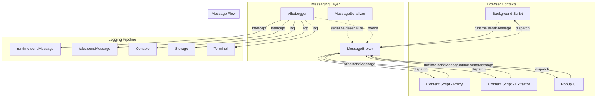
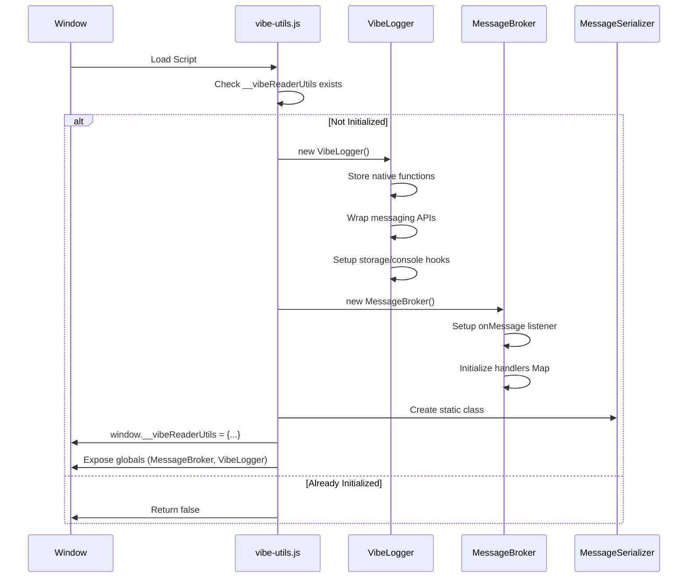
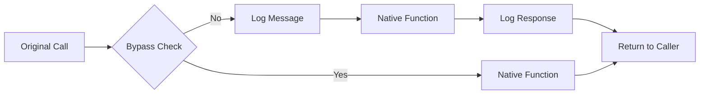
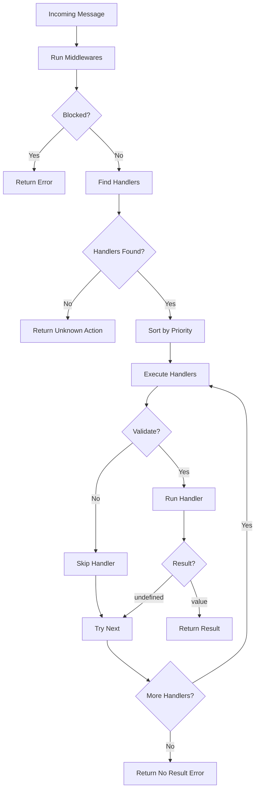

# VibeReader Utilities Documentation

## Table of Contents
- [Architecture Overview](#architecture-overview)
- [Core Components](#core-components)
- [VibeLogger](#vibelogger)
- [MessageBroker](#messagebroker)
- [MessageSerializer](#messageserializer)
- [Integration Patterns](#integration-patterns)
- [Configuration](#configuration)
- [Debugging](#debugging)

## Architecture Overview

VibeReader utilities provide a robust messaging and debugging infrastructure for the extension's multi-context architecture (background, content scripts, popup).



## Core Components

### Component Initialization Flow



## VibeLogger

### Overview
VibeLogger provides comprehensive message debugging and logging across all extension contexts. It intercepts, logs, and analyzes all message passing between components.

### Constructor
```javascript
new VibeLogger()
```
Initializes the logger with default settings and wraps browser messaging APIs.

### Properties

| Property | Type | Default | Description |
|----------|------|---------|-------------|
| `enabled` | boolean | true | Master toggle for logging |
| `logToConsole` | boolean | true | Output to browser console |
| `logToStorage` | boolean | true | Persist logs to storage |
| `logToTerminal` | boolean | true | Send to proxy terminal UI |
| `messageLog` | Array | [] | In-memory message buffer |
| `maxLogSize` | number | 500 | Maximum log entries |
| `filters` | Object | {...} | Message filtering rules |
| `context` | string | auto | Current execution context |

### Methods

#### `init()`
```javascript
async init()
```
Initializes the logger, loads settings, detects context, and wraps messaging APIs.

**Implementation:**
1. Loads debug settings from storage
2. Detects execution context (background/proxy/extractor/popup)
3. Stores native browser API references
4. Wraps `runtime.sendMessage` and `tabs.sendMessage`
5. Sets up toggle message listener

#### `enable()` / `disable()`
```javascript
enable()
disable()
```
Dynamically enables/disables message interception without reloading.

#### `wrapMessagingAPIs()`
```javascript
wrapMessagingAPIs()
```
Wraps browser messaging APIs to intercept and log messages.

**Intercept Flow:**


#### `logMessage(type, action, data, context)`
```javascript
logMessage(type, action, data, context = {})
```
Core logging method that processes and routes messages.

**Parameters:**
- `type`: 'send' | 'receive' | 'broadcast' | 'error' | 'forward' | 'response'
- `action`: Message action identifier
- `data`: Message payload
- `context`: Source, target, tabId, frameId, URL, stack trace

**Returns:** Log entry object

#### `consoleOutput(entry)`
Formats and outputs log entries to browser console with color coding.

**Color Scheme:**
- Popup: #ff6b6b
- Background: #4ecdc4
- Proxy: #45b7d1
- Extractor: #96ceb4

#### `terminalOutput(entry)`
Sends log entries to proxy terminal UI using bypass flag to prevent recursion.

#### `storageOutput(entry)`
Persists log entries to browser.storage.local for analysis.

#### `shouldLog(action, source)`
```javascript
shouldLog(action, source)
```
Determines if a message should be logged based on filters.

**Filter Configuration:**
```javascript
filters: {
    actions: [],        // Whitelist specific actions
    exclude: ['ping'], // Blacklist actions
    sources: []        // Filter by source context
}
```

#### `analyzeFlow()`
Generates message flow statistics and patterns.

**Output:**
- Message counts by action
- Average timing by action
- Message flow visualization

#### `dumpLog()`
Outputs formatted log table to console with analysis.

#### `exportLog()`
Exports complete log with metadata as JSON file.

### Bypass Mechanism

Special messages can bypass logging using the `BYPASS_LOGGING` symbol:

```javascript
const BYPASS_LOGGING = Symbol('bypass');

// Message that won't be logged
browser.runtime.sendMessage({
    [BYPASS_LOGGING]: true,
    action: 'terminalLog',
    data: {...}
});
```

## MessageBroker

### Overview
MessageBroker provides a unified message handling system with routing, validation, and middleware support.

### Constructor
```javascript
new MessageBroker()
```
Creates a broker instance and automatically registers as the runtime.onMessage listener.

### Properties

| Property | Type | Description |
|----------|------|-------------|
| `handlers` | Map | Action -> handler mappings |
| `middlewares` | Array | Pre-processing functions |
| `context` | string | Execution context |

### Methods

#### `on(action, handler, options)`
```javascript
on(action, handler, options = {})
```
Registers a handler for an action with optional priority and validation.

**Parameters:**
- `action`: String identifier
- `handler`: Async function(request, sender)
- `options.priority`: Handler execution order (higher first)
- `options.validate`: Validation function

**Example:**
```javascript
broker.on('extractContent', 
    async (request, sender) => {...},
    { 
        priority: 10,
        validate: (req) => req.data && req.data.url 
    }
);
```

#### `register(action, handler)`
```javascript
register(action, handler)
```
Simplified registration with automatic success wrapping.

**Example:**
```javascript
broker.register('ping', () => ({ type: 'proxy' }));
```

#### `use(middleware)`
```javascript
use(middleware)
```
Adds middleware function for all messages.

**Middleware Signature:**
```javascript
async function middleware(request, sender) {
    // Return false to block message
    // Modify request object
    // Return anything else to continue
}
```

#### `dispatch(request, sender)`
```javascript
async dispatch(request, sender)
```
Main message routing and handling.

**Flow:**


#### `send(target, action, data)`
```javascript
async send(target, action, data)
```
Sends a message with automatic routing.

**Parameters:**
- `target`: Tab ID (number) or null for runtime
- `action`: Message action
- `data`: Payload

**Returns:** Promise resolving to response

## MessageSerializer

### Overview
Static utility class for serializing complex objects for message passing.

### Methods

#### `serialize(obj, seen)`
```javascript
static serialize(obj, seen = new WeakSet())
```
Converts complex objects to message-safe format.

**Handles:**
- Circular references
- Error objects
- DOM Elements
- Date objects
- undefined values

**Example:**
```javascript
const serialized = MessageSerializer.serialize({
    error: new Error('Test'),
    element: document.body,
    date: new Date(),
    circular: null
});
// Circular reference added after
serialized.circular = serialized;
```

#### `deserialize(obj)`
```javascript
static deserialize(obj)
```
Reconstructs objects from serialized format.

## Integration Patterns

### Pattern 1: Simple Request/Response
```javascript
// Sender
const response = await browser.runtime.sendMessage({
    action: 'getData',
    id: 123
});

// Handler
broker.register('getData', async (request) => {
    const data = await fetchData(request.id);
    return { data };
});
```

### Pattern 2: Broadcast to All Tabs
```javascript
// Broadcaster
const tabs = await browser.tabs.query({});
for (const tab of tabs) {
    broker.send(tab.id, 'notification', { 
        message: 'Update available' 
    });
}

// Receivers
broker.register('notification', (data) => {
    showNotification(data.message);
});
```

### Pattern 3: Command Pattern with Validation
```javascript
broker.on('executeCommand', 
    async (request) => {
        const { command, params } = request;
        switch(command) {
            case 'scroll':
                window.scrollTo(0, params.position);
                return { success: true };
            default:
                throw new Error('Unknown command');
        }
    },
    {
        priority: 5,
        validate: (req) => req.command && req.params
    }
);
```

### Pattern 4: Event Emission
```javascript
// Event emitter wrapper
class EventEmitter {
    constructor(broker) {
        this.broker = broker;
    }
    
    emit(event, data) {
        this.broker.send(null, 'event', { 
            type: event, 
            data 
        });
    }
    
    on(event, handler) {
        this.broker.register('event', (request) => {
            if (request.type === event) {
                handler(request.data);
            }
        });
    }
}
```

## Configuration

### VibeLogger Settings
```javascript
// Programmatic configuration
window.vibeDebug.enabled = false;
window.vibeDebug.logToConsole = true;
window.vibeDebug.filters = {
    exclude: ['ping', 'heartbeat'],
    actions: ['extractContent', 'displayContent']
};

// Persistent configuration
await browser.storage.local.set({
    vibeDebugSettings: {
        enabled: true,
        logToConsole: true,
        logToStorage: false,
        logToTerminal: true,
        filters: {...}
    }
});
```

### MessageBroker Middleware
```javascript
// Authentication middleware
broker.use(async (request, sender) => {
    if (request.requiresAuth && !sender.tab) {
        return false; // Block non-tab messages
    }
});

// Logging middleware
broker.use(async (request, sender) => {
    console.log(`Message: ${request.action} from ${sender.id}`);
});

// Rate limiting middleware
const rateLimits = new Map();
broker.use(async (request, sender) => {
    const key = `${sender.id}-${request.action}`;
    const now = Date.now();
    const last = rateLimits.get(key) || 0;
    
    if (now - last < 100) { // 100ms throttle
        return false;
    }
    
    rateLimits.set(key, now);
});
```

## Debugging

### Console Commands
```javascript
// Toggle debug mode
vibeDebug.toggle()

// Dump current log
vibeDebug.dumpLog()

// Clear log
vibeDebug.clearLog()

// Export log to file
vibeDebug.exportLog()

// Analyze message flow
vibeDebug.analyzeFlow()

// Filter messages
vibeDebug.filters.actions = ['extractContent']
vibeDebug.filters.exclude = ['ping']
```

### Keyboard Shortcuts
- `Ctrl+Shift+D`: Toggle debug mode
- `Ctrl+Shift+L`: Dump log to console

### Performance Analysis
```javascript
// Get timing statistics
const stats = vibeDebug.messageLog.reduce((acc, entry) => {
    const action = entry.action;
    if (!acc[action]) {
        acc[action] = { count: 0, totalTime: 0 };
    }
    acc[action].count++;
    acc[action].totalTime += entry.performance.timing;
    return acc;
}, {});

// Average response times
Object.entries(stats).forEach(([action, data]) => {
    console.log(`${action}: ${(data.totalTime / data.count).toFixed(2)}ms avg`);
});
```

### Message Flow Visualization
```javascript
// Visual flow in console
vibeDebug.visualizeFlow()

// Output:
// background → tab-123: extractContent
// tab-123 → background: contentExtracted
// background → tab-456: displayContent
```

## Error Handling

### Automatic Error Serialization
```javascript
try {
    // Some operation
} catch (error) {
    broker.send(null, 'error', {
        error: MessageSerializer.serialize(error)
    });
}

// Handler receives full error with stack
broker.register('error', (data) => {
    const error = MessageSerializer.deserialize(data.error);
    console.error(error.stack);
});
```

### Graceful Degradation
```javascript
// Check if utilities are available
if (window.__vibeReaderUtils) {
    const broker = new MessageBroker();
    // Use broker
} else {
    // Fallback to direct messaging
    browser.runtime.onMessage.addListener(...);
}
```

## Security Considerations

1. **Message Validation**: Always validate incoming messages
2. **Origin Checking**: Verify sender.tab properties
3. **Bypass Symbols**: Use symbols to prevent string collision
4. **Sanitization**: Messages are serialized, removing functions
5. **Context Isolation**: Each context has its own broker instance

## Performance Optimization

1. **Lazy Loading**: VibeLogger only wraps APIs when enabled
2. **WeakSet for Circular**: Prevents memory leaks in serialization
3. **Throttling**: Built-in message throttling support
4. **Selective Logging**: Filter to reduce overhead
5. **Bypass Flag**: Critical messages skip logging overhead