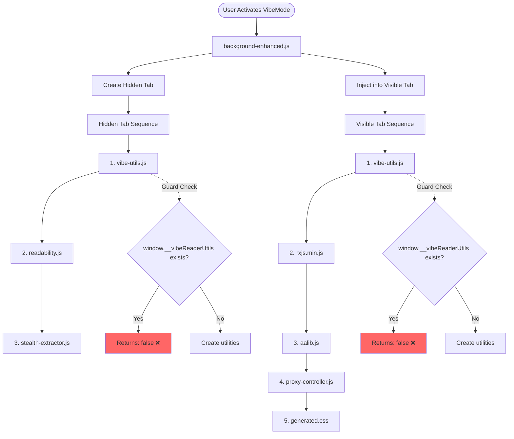

Looking at your code, I can trace the injection flow and identify several issues with the utility injection pattern. Here's the flow diagram and problems:

## Injection Flow Diagram



## Critical Issues Found

### 1. **Broken Injection Guards**
```javascript
// vibe-utils.js has this pattern:
if (window.__vibeReaderUtils) {
  console.log("⚠️ VibeReaderUtils already exists, skipping");
  false;  // ❌ This doesn't prevent execution!
} else {
  // ... creates utilities
}
```

**Problem**: The `false;` statement doesn't actually exit - JavaScript continues executing! This should be:
```javascript
if (window.__vibeReaderUtils) {
  console.log("⚠️ VibeReaderUtils already exists, skipping");
  return; // Or throw an error
}
```

### 2. **VibeLogger Double-Wrapping**
The VibeLogger wraps browser messaging APIs but stores "native" functions that might already be wrapped:
```javascript
// In VibeLogger.init()
if (!browser.runtime.__vibeNatives) {
  browser.runtime.__vibeNatives = {
    sendMessage: browser.runtime.sendMessage.bind(browser.runtime),
    // But sendMessage might ALREADY be wrapped from a previous injection!
  };
}
```

### 3. **Utility Availability Issues**
```javascript
// In proxy-controller.js constructor:
if (window.VibeLogger) {
  window.VibeLogger.setTerminalHandler(...);
}
```
This assumes utilities are available, but due to the broken guard, they might not initialize properly on re-injection.

### 4. **Memory Leak Pattern**
The MessageBroker and event listeners aren't properly cleaned up:
```javascript
// proxy-controller.js setupEventListeners() adds tons of listeners
this.messageBroker.on('extraction-start', () => {...});
// But in deactivate(), only clears the Map, doesn't remove listeners:
if (this.messageBroker) {
  this.messageBroker.listeners.clear(); // Doesn't unbind from DOM!
}
```

## Fixed Injection Pattern

Here's how to fix the injection guards properly:

```javascript
// vibe-utils-fixed.js
(function() {
  'use strict';
  
  // Proper guard with early return
  if (window.__vibeReaderUtils) {
    console.log("⚠️ VibeReaderUtils already exists, skipping");
    return; // Actually exits!
  }
  
  // Prevent re-injection during initialization
  window.__vibeReaderUtils = {
    initializing: true
  };
  
  try {
    // ... create all utilities ...
    
    window.__vibeReaderUtils = {
      VibeLogger: new VibeLogger(),
      MessageSerializer: MessageSerializer,
      MessageBroker: MessageBroker,
      ThrottledEmitter: ThrottledEmitter,
      initialized: true
    };
    
    return true; // Signal success
  } catch (error) {
    delete window.__vibeReaderUtils; // Clean up on failure
    throw error;
  }
})();
```

## Recommended Injection Sequence Fix

```javascript
// In background-enhanced.js
async injectProxyController(tabId) {
  try {
    // Check if already injected properly
    const checkResult = await browser.tabs.executeScript(tabId, {
      code: 'typeof window.__vibeReaderUtils !== "undefined" && window.__vibeReaderUtils.initialized === true'
    });
    
    if (checkResult[0]) {
      console.log('✅ Utils already properly loaded');
      // Skip vibe-utils injection
    } else {
      // Clean up any broken state
      await browser.tabs.executeScript(tabId, {
        code: 'delete window.__vibeReaderUtils; delete window.__vibeReaderProxyController;'
      });
      
      // Fresh injection
      await browser.tabs.executeScript(tabId, {
        file: 'src/vibe-utils.js',
        runAt: 'document_end'
      });
    }
    
    // Continue with other dependencies...
  } catch (error) {
    console.error('Injection failed:', error);
  }
}
```

The main issues are:
1. Guards return `false` instead of exiting
2. No cleanup of previous injection state
3. VibeLogger can double-wrap messaging APIs
4. Memory leaks from event listeners
5. No proper initialization checking

These issues would cause utilities to not work properly on re-injection or page refresh, exactly as you're experiencing.